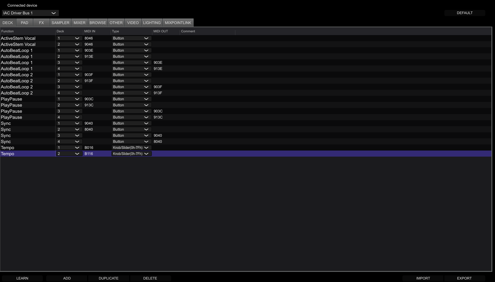
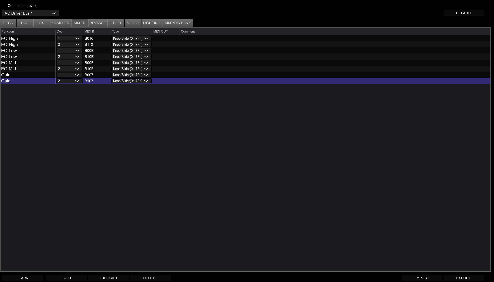

# DJ Hand Controller

A gesture-to-MIDI/OSC DJ controller that uses a webcam to interpret hand movements and control DJ software. This project leverages Python with OpenCV for video processing and MediaPipe for hand tracking.

## Features (for now)

- **Dual Deck Control:** Control two DJ decks independently using your left and right hands.
- **Play/Pause Toggle:** Start and stop tracks with a simple gesture.
- **Volume & Tempo Control:** Adjust gain and tempo with vertical hand movements.
- **Multi-Band EQ Control:** Dynamically control Low, Mid, and High EQs.
- **Stem Toggles:** Mute and unmute Drums, Vocals, and Instrumentals using gestures with the back of your hand.
- **Looping:** Activate 1-beat and 2-beat loops.
- **Beat Sync:** Synchronize the tempo of both decks.

## Prerequisites

1.  **Python:** This project uses Python 3.8+. You can download it from [python.org](https://www.python.org/downloads/).
2.  **Webcam:** A standard webcam is required for hand tracking.
3.  **Virtual MIDI Driver:** You must have a virtual MIDI driver installed and running to route MIDI signals from this script to your DJ software.
    - **macOS:** The built-in **IAC Driver** is perfect. To enable it:
      1.  Open the "Audio MIDI Setup" application.
      2.  Go to `Window > Show MIDI Studio`.
      3.  Double-click on "IAC Driver".
      4.  Make sure the "Device is online" checkbox is checked.
    - **Windows:** A great free option is [**loopMIDI**](https://www.tobias-erichsen.de/software/loopmidi.html). Download, install, and create at least one MIDI port.
4.  **DJ Software:** Your DJ software (e.g., Traktor, Serato, Rekordbox, VirtualDJ) must be configured to accept MIDI input from the virtual driver you set up.

## Setup

1.  **Clone the repository:**

    ```bash
    git clone https://github.com/JustinTjitra/mini-dj.git
    cd mini-dj
    ```

2.  **Create and activate a virtual environment:**

    - **macOS / Linux:**
      ```bash
      python3 -m venv venv
      source venv/bin/activate
      ```
    - **Windows:**
      ```bash
      python -m venv venv
      .\venv\Scripts\activate
      ```

3.  **Install the required libraries:**
    ```bash
    pip install -r requirements.txt
    ```

## Example MIDI Setup



The image here shows the functions under the DECK section of MIDI settings in rekordbox. To edit the MIDI IN and MIDI OUT, double click on the box, type in your corresponding value, and press ENTER.



The image here shows the functions under the MIXER section of MIDI settings in rekordbox. To edit the MIDI IN and MIDI OUT, double click on the box, type in your corresponding value, and press ENTER.

## Usage

1.  Ensure your virtual MIDI driver is running and your DJ software is open and listening for MIDI input.
2.  Run the script from your terminal:
    ```bash
    python src/main.py
    ```
3.  The script will list the available MIDI ports. Enter the number corresponding to your virtual MIDI driver and press Enter.
4.  The webcam window will open, and you can begin controlling the software with your hands. Press `ESC` to quit.

## Gesture Guide

IMPORTANT: Gestures are unfinished and are set to change according to their corresponding function.
Ensure that your hand is not too far from the camera in order for it to read your gestures.
More features to come... (longer loops, filters, cues, pads, etc.)

### Palm Facing Camera

| Gesture                         | Action                | Control Mechanism                                    |
| ------------------------------- | --------------------- | ---------------------------------------------------- |
| **Open Hand** (Wrist in Zone)   | Adjust Volume / EQ    | Wrist in GAIN bar / Enters EQ Increase/Decrease zone |
| **Closed Fist** (Wrist in Zone) | Adjust Tempo          | Wrist in TEMPO bar                                   |
| **Index Finger Up**             | Toggle Play/Pause     | Rising edge of gesture                               |
| **Index & Middle Fingers Up**   | Toggle 1-Beat Loop    | Rising edge of gesture                               |
| **Middle, Ring, Pinky Up**      | Toggle 2-Beat Loop    | Rising edge of gesture                               |
| **Wrist in EQ Mode Button**     | **Select EQ Mode:**   |                                                      |
| &nbsp;&nbsp;↳ Index Finger Up   | &nbsp;&nbsp;→ Low EQ  | Sets active EQ to Low                                |
| &nbsp;&nbsp;↳ Index/Middle Up   | &nbsp;&nbsp;→ Mid EQ  | Sets active EQ to Mid                                |
| &nbsp;&nbsp;↳ Mid/Ring/Pinky Up | &nbsp;&nbsp;→ High EQ | Sets active EQ to High                               |

_Note: When an EQ mode (Low, Mid, or High) is selected, place your wrist in the "INC. EQ" or "DEQ. EQ" zones and adjust the value by changing the distance between your index and middle fingertips._

### Back of Hand Facing Camera

| Gesture                       | Action                    | Control Mechanism      |
| ----------------------------- | ------------------------- | ---------------------- |
| **Index Finger Up**           | Toggle Drums Mute         | Rising edge of gesture |
| **Index & Middle Fingers Up** | Toggle Vocals Mute        | Rising edge of gesture |
| **Middle, Ring, Pinky Up**    | Toggle Instrumentals Mute | Rising edge of gesture |

---
